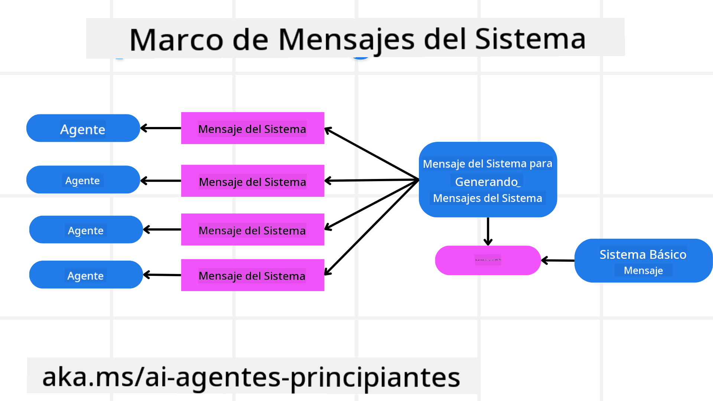
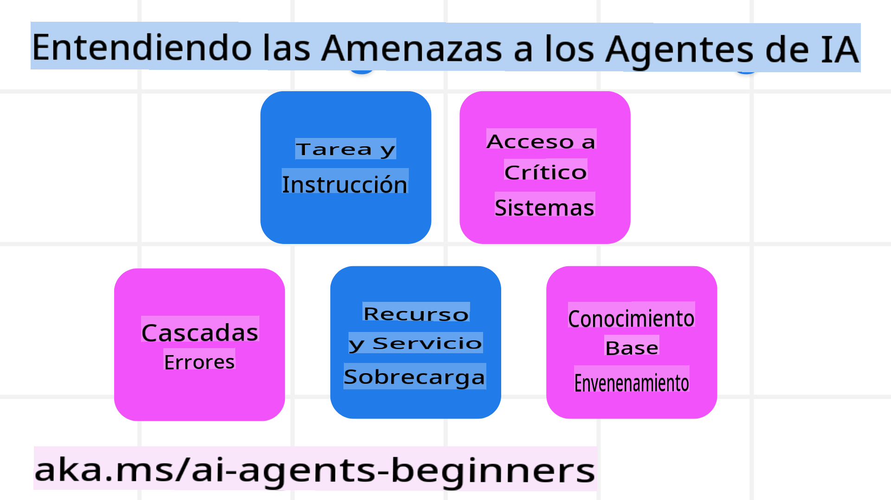

<!--
CO_OP_TRANSLATOR_METADATA:
{
  "original_hash": "f57852cac3a86c4a5ef47f793cc12178",
  "translation_date": "2025-05-20T09:00:07+00:00",
  "source_file": "06-building-trustworthy-agents/README.md",
  "language_code": "es"
}
-->
[](https://youtu.be/iZKkMEGBCUQ?si=Q-kEbcyHUMPoHp8L)

> _(Haz clic en la imagen de arriba para ver el video de esta lección)_

# Construyendo Agentes de IA Confiables

## Introducción

Esta lección cubrirá:

- Cómo construir y desplegar Agentes de IA seguros y efectivos.
- Consideraciones importantes de seguridad al desarrollar Agentes de IA.
- Cómo mantener la privacidad de los datos y de los usuarios al desarrollar Agentes de IA.

## Objetivos de Aprendizaje

Después de completar esta lección, sabrás cómo:

- Identificar y mitigar riesgos al crear Agentes de IA.
- Implementar medidas de seguridad para asegurar que los datos y accesos se gestionen correctamente.
- Crear Agentes de IA que mantengan la privacidad de los datos y brinden una experiencia de usuario de calidad.

## Seguridad

Primero, veamos cómo construir aplicaciones agenticas seguras. Seguridad significa que el agente de IA funciona según lo diseñado. Como desarrolladores de aplicaciones agenticas, contamos con métodos y herramientas para maximizar la seguridad:

### Construyendo un Marco de Mensajes del Sistema

Si alguna vez has construido una aplicación de IA usando Large Language Models (LLMs), sabes la importancia de diseñar un prompt o mensaje del sistema robusto. Estos prompts establecen las reglas meta, instrucciones y directrices sobre cómo el LLM interactuará con el usuario y los datos.

Para los Agentes de IA, el prompt del sistema es aún más importante, ya que los agentes necesitarán instrucciones muy específicas para completar las tareas que hemos diseñado para ellos.

Para crear prompts del sistema escalables, podemos usar un marco de mensajes del sistema para construir uno o más agentes en nuestra aplicación:



#### Paso 1: Crear un Mensaje Meta del Sistema

El meta prompt será utilizado por un LLM para generar los prompts del sistema para los agentes que creemos. Lo diseñamos como una plantilla para poder crear múltiples agentes de manera eficiente si es necesario.

Aquí hay un ejemplo de un mensaje meta del sistema que le daríamos al LLM:

```plaintext
You are an expert at creating AI agent assistants. 
You will be provided a company name, role, responsibilities and other
information that you will use to provide a system prompt for.
To create the system prompt, be descriptive as possible and provide a structure that a system using an LLM can better understand the role and responsibilities of the AI assistant. 
```

#### Paso 2: Crear un prompt básico

El siguiente paso es crear un prompt básico para describir al Agente de IA. Debes incluir el rol del agente, las tareas que realizará y cualquier otra responsabilidad del agente.

Aquí tienes un ejemplo:

```plaintext
You are a travel agent for Contoso Travel that is great at booking flights for customers. To help customers you can perform the following tasks: lookup available flights, book flights, ask for preferences in seating and times for flights, cancel any previously booked flights and alert customers on any delays or cancellations of flights.  
```

#### Paso 3: Proporcionar el Mensaje Básico del Sistema al LLM

Ahora podemos optimizar este mensaje del sistema proporcionando el mensaje meta del sistema como mensaje del sistema junto con nuestro mensaje básico.

Esto producirá un mensaje del sistema mejor diseñado para guiar a nuestros agentes de IA:

```markdown
**Company Name:** Contoso Travel  
**Role:** Travel Agent Assistant

**Objective:**  
You are an AI-powered travel agent assistant for Contoso Travel, specializing in booking flights and providing exceptional customer service. Your main goal is to assist customers in finding, booking, and managing their flights, all while ensuring that their preferences and needs are met efficiently.

**Key Responsibilities:**

1. **Flight Lookup:**
    
    - Assist customers in searching for available flights based on their specified destination, dates, and any other relevant preferences.
    - Provide a list of options, including flight times, airlines, layovers, and pricing.
2. **Flight Booking:**
    
    - Facilitate the booking of flights for customers, ensuring that all details are correctly entered into the system.
    - Confirm bookings and provide customers with their itinerary, including confirmation numbers and any other pertinent information.
3. **Customer Preference Inquiry:**
    
    - Actively ask customers for their preferences regarding seating (e.g., aisle, window, extra legroom) and preferred times for flights (e.g., morning, afternoon, evening).
    - Record these preferences for future reference and tailor suggestions accordingly.
4. **Flight Cancellation:**
    
    - Assist customers in canceling previously booked flights if needed, following company policies and procedures.
    - Notify customers of any necessary refunds or additional steps that may be required for cancellations.
5. **Flight Monitoring:**
    
    - Monitor the status of booked flights and alert customers in real-time about any delays, cancellations, or changes to their flight schedule.
    - Provide updates through preferred communication channels (e.g., email, SMS) as needed.

**Tone and Style:**

- Maintain a friendly, professional, and approachable demeanor in all interactions with customers.
- Ensure that all communication is clear, informative, and tailored to the customer's specific needs and inquiries.

**User Interaction Instructions:**

- Respond to customer queries promptly and accurately.
- Use a conversational style while ensuring professionalism.
- Prioritize customer satisfaction by being attentive, empathetic, and proactive in all assistance provided.

**Additional Notes:**

- Stay updated on any changes to airline policies, travel restrictions, and other relevant information that could impact flight bookings and customer experience.
- Use clear and concise language to explain options and processes, avoiding jargon where possible for better customer understanding.

This AI assistant is designed to streamline the flight booking process for customers of Contoso Travel, ensuring that all their travel needs are met efficiently and effectively.

```

#### Paso 4: Iterar y Mejorar

El valor de este marco de mensajes del sistema es poder escalar la creación de mensajes para múltiples agentes más fácilmente, así como mejorar tus mensajes del sistema con el tiempo. Es raro que tengas un mensaje del sistema que funcione perfectamente la primera vez para tu caso de uso completo. Poder hacer pequeños ajustes y mejoras cambiando el mensaje básico y ejecutándolo a través del sistema te permitirá comparar y evaluar resultados.

## Entendiendo las Amenazas

Para construir agentes de IA confiables, es importante entender y mitigar los riesgos y amenazas hacia tu agente de IA. Veamos algunas de las diferentes amenazas a los agentes de IA y cómo puedes planificar y prepararte mejor para ellas.



### Tarea e Instrucción

**Descripción:** Los atacantes intentan cambiar las instrucciones o metas del agente de IA mediante prompts o manipulando las entradas.

**Mitigación:** Ejecuta verificaciones de validación y filtros de entrada para detectar prompts potencialmente peligrosos antes de que sean procesados por el Agente de IA. Dado que estos ataques generalmente requieren interacción frecuente con el Agente, limitar el número de turnos en una conversación es otra forma de prevenir este tipo de ataques.

### Acceso a Sistemas Críticos

**Descripción:** Si un agente de IA tiene acceso a sistemas y servicios que almacenan datos sensibles, los atacantes pueden comprometer la comunicación entre el agente y estos servicios. Estos pueden ser ataques directos o intentos indirectos de obtener información sobre estos sistemas a través del agente.

**Mitigación:** Los agentes de IA deben tener acceso a sistemas solo cuando sea necesario para prevenir este tipo de ataques. La comunicación entre el agente y el sistema también debe ser segura. Implementar autenticación y control de acceso es otra forma de proteger esta información.

### Sobrecarga de Recursos y Servicios

**Descripción:** Los agentes de IA pueden acceder a diferentes herramientas y servicios para completar tareas. Los atacantes pueden usar esta capacidad para atacar estos servicios enviando un alto volumen de solicitudes a través del Agente de IA, lo que puede resultar en fallos del sistema o costos elevados.

**Mitigación:** Implementa políticas para limitar el número de solicitudes que un agente de IA puede hacer a un servicio. Limitar el número de turnos en la conversación y solicitudes a tu agente de IA es otra forma de prevenir este tipo de ataques.

### Envenenamiento de la Base de Conocimiento

**Descripción:** Este tipo de ataque no se dirige directamente al agente de IA, sino a la base de conocimiento y otros servicios que el agente usará. Esto podría implicar corromper los datos o la información que el agente usará para completar una tarea, lo que lleva a respuestas sesgadas o no deseadas para el usuario.

**Mitigación:** Realiza verificaciones regulares de los datos que el agente de IA usará en sus flujos de trabajo. Asegura que el acceso a estos datos sea seguro y que solo personas de confianza puedan modificarlos para evitar este tipo de ataque.

### Errores en Cascada

**Descripción:** Los agentes de IA acceden a varias herramientas y servicios para completar tareas. Errores causados por atacantes pueden provocar fallos en otros sistemas conectados al agente, haciendo que el ataque se extienda y sea más difícil de solucionar.

**Mitigación:** Una forma de evitar esto es que el Agente de IA opere en un entorno limitado, como realizar tareas en un contenedor Docker, para prevenir ataques directos al sistema. Crear mecanismos de respaldo y lógica de reintentos cuando ciertos sistemas respondan con un error es otra manera de evitar fallos mayores en el sistema.

## Humano en el Bucle

Otra forma efectiva de construir sistemas confiables de Agentes de IA es usando un Humano en el Bucle. Esto crea un flujo donde los usuarios pueden proporcionar retroalimentación a los Agentes durante la ejecución. Los usuarios actúan esencialmente como agentes en un sistema multi-agente, aprobando o terminando el proceso en ejecución.


Aquí hay un fragmento de código usando AutoGen para mostrar cómo se implementa este concepto:

```python

# Create the agents.
model_client = OpenAIChatCompletionClient(model="gpt-4o-mini")
assistant = AssistantAgent("assistant", model_client=model_client)
user_proxy = UserProxyAgent("user_proxy", input_func=input)  # Use input() to get user input from console.

# Create the termination condition which will end the conversation when the user says "APPROVE".
termination = TextMentionTermination("APPROVE")

# Create the team.
team = RoundRobinGroupChat([assistant, user_proxy], termination_condition=termination)

# Run the conversation and stream to the console.
stream = team.run_stream(task="Write a 4-line poem about the ocean.")
# Use asyncio.run(...) when running in a script.
await Console(stream)

```

## Conclusión

Construir agentes de IA confiables requiere un diseño cuidadoso, medidas de seguridad robustas y una iteración continua. Al implementar sistemas estructurados de meta prompting, entender las amenazas potenciales y aplicar estrategias de mitigación, los desarrolladores pueden crear agentes de IA que sean seguros y efectivos. Además, incorporar un enfoque de humano en el bucle asegura que los agentes de IA permanezcan alineados con las necesidades del usuario mientras se minimizan los riesgos. A medida que la IA continúa evolucionando, mantener una postura proactiva en seguridad, privacidad y consideraciones éticas será clave para fomentar la confianza y confiabilidad en los sistemas impulsados por IA.

## Recursos Adicionales

- <a href="https://learn.microsoft.com/azure/ai-studio/responsible-use-of-ai-overview" target="_blank">Resumen de IA Responsable</a>
- <a href="https://learn.microsoft.com/azure/ai-studio/concepts/evaluation-approach-gen-ai" target="_blank">Evaluación de modelos de IA generativa y aplicaciones de IA</a>
- <a href="https://learn.microsoft.com/azure/ai-services/openai/concepts/system-message?context=%2Fazure%2Fai-studio%2Fcontext%2Fcontext&tabs=top-techniques" target="_blank">Mensajes del sistema para seguridad</a>
- <a href="https://blogs.microsoft.com/wp-content/uploads/prod/sites/5/2022/06/Microsoft-RAI-Impact-Assessment-Template.pdf?culture=en-us&country=us" target="_blank">Plantilla de Evaluación de Riesgos</a>

## Lección Anterior

[Agentic RAG](../05-agentic-rag/README.md)

## Próxima Lección

[Planning Design Pattern](../07-planning-design/README.md)

**Descargo de responsabilidad**:  
Este documento ha sido traducido utilizando el servicio de traducción automática [Co-op Translator](https://github.com/Azure/co-op-translator). Aunque nos esforzamos por la precisión, tenga en cuenta que las traducciones automáticas pueden contener errores o inexactitudes. El documento original en su idioma nativo debe considerarse la fuente autorizada. Para información crítica, se recomienda la traducción profesional realizada por humanos. No nos hacemos responsables de malentendidos o interpretaciones erróneas que puedan surgir del uso de esta traducción.