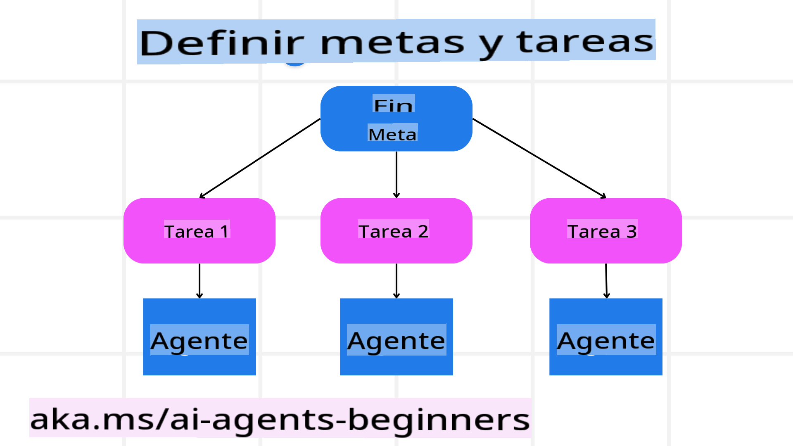

<!--
CO_OP_TRANSLATOR_METADATA:
{
  "original_hash": "e4e06d3b5d6207459a019c05fee5eb4b",
  "translation_date": "2025-05-20T09:00:30+00:00",
  "source_file": "07-planning-design/README.md",
  "language_code": "es"
}
-->
[](https://youtu.be/kPfJ2BrBCMY?si=9pYpPXp0sSbK91Dr)

> _(Haz clic en la imagen arriba para ver el video de esta lección)_

# Diseño de Planificación

## Introducción

Esta lección cubrirá

* Definir un objetivo general claro y descomponer una tarea compleja en tareas manejables.
* Aprovechar la salida estructurada para obtener respuestas más confiables y legibles por máquinas.
* Aplicar un enfoque basado en eventos para manejar tareas dinámicas e inputs inesperados.

## Objetivos de Aprendizaje

Después de completar esta lección, tendrás comprensión sobre:

* Identificar y establecer un objetivo general para un agente de IA, asegurando que sepa claramente qué debe lograr.
* Descomponer una tarea compleja en subtareas manejables y organizarlas en una secuencia lógica.
* Dotar a los agentes con las herramientas adecuadas (por ejemplo, herramientas de búsqueda o análisis de datos), decidir cuándo y cómo se usan, y manejar situaciones inesperadas que surjan.
* Evaluar los resultados de las subtareas, medir el rendimiento e iterar sobre las acciones para mejorar el resultado final.

## Definiendo el Objetivo General y Descomponiendo una Tarea



La mayoría de las tareas del mundo real son demasiado complejas para abordarlas en un solo paso. Un agente de IA necesita un objetivo conciso que guíe su planificación y acciones. Por ejemplo, considera el objetivo:

    "Generar un itinerario de viaje de 3 días."

Aunque es simple de enunciar, aún requiere refinamiento. Cuanto más claro sea el objetivo, mejor podrá el agente (y cualquier colaborador humano) enfocarse en lograr el resultado correcto, como crear un itinerario completo con opciones de vuelo, recomendaciones de hoteles y sugerencias de actividades.

### Descomposición de Tareas

Las tareas grandes o complejas se vuelven más manejables cuando se dividen en subtareas orientadas a objetivos.
Para el ejemplo del itinerario de viaje, podrías descomponer el objetivo en:

* Reserva de vuelo
* Reserva de hotel
* Alquiler de coche
* Personalización

Cada subtarea puede ser abordada por agentes o procesos dedicados. Un agente podría especializarse en buscar las mejores ofertas de vuelo, otro en reservas de hotel, y así sucesivamente. Un agente coordinador o “aguas abajo” puede entonces compilar estos resultados en un itinerario cohesivo para el usuario final.

Este enfoque modular también permite mejoras incrementales. Por ejemplo, podrías agregar agentes especializados para recomendaciones de comida o sugerencias de actividades locales y refinar el itinerario con el tiempo.

### Salida estructurada

Los Modelos de Lenguaje Grandes (LLMs) pueden generar salidas estructuradas (por ejemplo, JSON) que son más fáciles de analizar y procesar para agentes o servicios aguas abajo. Esto es especialmente útil en un contexto multi-agente, donde podemos ejecutar estas tareas después de recibir la salida de la planificación. Consulta esto para una visión rápida.

El siguiente fragmento de Python demuestra un agente de planificación simple que descompone un objetivo en subtareas y genera un plan estructurado:

```python
from pydantic import BaseModel
from enum import Enum
from typing import List, Optional, Union
import json
import os
from typing import Optional
from pprint import pprint
from autogen_core.models import UserMessage, SystemMessage, AssistantMessage
from autogen_ext.models.azure import AzureAIChatCompletionClient
from azure.core.credentials import AzureKeyCredential

class AgentEnum(str, Enum):
    FlightBooking = "flight_booking"
    HotelBooking = "hotel_booking"
    CarRental = "car_rental"
    ActivitiesBooking = "activities_booking"
    DestinationInfo = "destination_info"
    DefaultAgent = "default_agent"
    GroupChatManager = "group_chat_manager"

# Travel SubTask Model
class TravelSubTask(BaseModel):
    task_details: str
    assigned_agent: AgentEnum  # we want to assign the task to the agent

class TravelPlan(BaseModel):
    main_task: str
    subtasks: List[TravelSubTask]
    is_greeting: bool

client = AzureAIChatCompletionClient(
    model="gpt-4o-mini",
    endpoint="https://models.inference.ai.azure.com",
    # To authenticate with the model you will need to generate a personal access token (PAT) in your GitHub settings.
    # Create your PAT token by following instructions here: https://docs.github.com/en/authentication/keeping-your-account-and-data-secure/managing-your-personal-access-tokens
    credential=AzureKeyCredential(os.environ["GITHUB_TOKEN"]),
    model_info={
        "json_output": False,
        "function_calling": True,
        "vision": True,
        "family": "unknown",
    },
)

# Define the user message
messages = [
    SystemMessage(content="""You are an planner agent.
    Your job is to decide which agents to run based on the user's request.
                      Provide your response in JSON format with the following structure:
{'main_task': 'Plan a family trip from Singapore to Melbourne.',
 'subtasks': [{'assigned_agent': 'flight_booking',
               'task_details': 'Book round-trip flights from Singapore to '
                               'Melbourne.'}
    Below are the available agents specialised in different tasks:
    - FlightBooking: For booking flights and providing flight information
    - HotelBooking: For booking hotels and providing hotel information
    - CarRental: For booking cars and providing car rental information
    - ActivitiesBooking: For booking activities and providing activity information
    - DestinationInfo: For providing information about destinations
    - DefaultAgent: For handling general requests""", source="system"),
    UserMessage(
        content="Create a travel plan for a family of 2 kids from Singapore to Melboune", source="user"),
]

response = await client.create(messages=messages, extra_create_args={"response_format": 'json_object'})

response_content: Optional[str] = response.content if isinstance(
    response.content, str) else None
if response_content is None:
    raise ValueError("Response content is not a valid JSON string" )

pprint(json.loads(response_content))

# # Ensure the response content is a valid JSON string before loading it
# response_content: Optional[str] = response.content if isinstance(
#     response.content, str) else None
# if response_content is None:
#     raise ValueError("Response content is not a valid JSON string")

# # Print the response content after loading it as JSON
# pprint(json.loads(response_content))

# Validate the response content with the MathReasoning model
# TravelPlan.model_validate(json.loads(response_content))
```

### Agente de Planificación con Orquestación Multi-Agente

En este ejemplo, un Agente Router Semántico recibe una solicitud del usuario (por ejemplo, "Necesito un plan de hotel para mi viaje.").

El planificador entonces:

* Recibe el Plan de Hotel: El planificador toma el mensaje del usuario y, basado en un prompt del sistema (incluyendo detalles de agentes disponibles), genera un plan de viaje estructurado.
* Lista Agentes y sus Herramientas: El registro de agentes contiene una lista de agentes (por ejemplo, para vuelos, hoteles, alquiler de coches y actividades) junto con las funciones o herramientas que ofrecen.
* Dirige el Plan a los Agentes Correspondientes: Dependiendo del número de subtareas, el planificador envía el mensaje directamente a un agente dedicado (para escenarios de tarea única) o coordina mediante un gestor de chat grupal para colaboración multi-agente.
* Resume el Resultado: Finalmente, el planificador resume el plan generado para mayor claridad.

El siguiente código Python ilustra estos pasos:

```python

from pydantic import BaseModel

from enum import Enum
from typing import List, Optional, Union

class AgentEnum(str, Enum):
    FlightBooking = "flight_booking"
    HotelBooking = "hotel_booking"
    CarRental = "car_rental"
    ActivitiesBooking = "activities_booking"
    DestinationInfo = "destination_info"
    DefaultAgent = "default_agent"
    GroupChatManager = "group_chat_manager"

# Travel SubTask Model

class TravelSubTask(BaseModel):
    task_details: str
    assigned_agent: AgentEnum # we want to assign the task to the agent

class TravelPlan(BaseModel):
    main_task: str
    subtasks: List[TravelSubTask]
    is_greeting: bool
import json
import os
from typing import Optional

from autogen_core.models import UserMessage, SystemMessage, AssistantMessage
from autogen_ext.models.openai import AzureOpenAIChatCompletionClient

# Create the client with type-checked environment variables

client = AzureOpenAIChatCompletionClient(
    azure_deployment=os.getenv("AZURE_OPENAI_DEPLOYMENT_NAME"),
    model=os.getenv("AZURE_OPENAI_DEPLOYMENT_NAME"),
    api_version=os.getenv("AZURE_OPENAI_API_VERSION"),
    azure_endpoint=os.getenv("AZURE_OPENAI_ENDPOINT"),
    api_key=os.getenv("AZURE_OPENAI_API_KEY"),
)

from pprint import pprint

# Define the user message

messages = [
    SystemMessage(content="""You are an planner agent.
    Your job is to decide which agents to run based on the user's request.
    Below are the available agents specialized in different tasks:
    - FlightBooking: For booking flights and providing flight information
    - HotelBooking: For booking hotels and providing hotel information
    - CarRental: For booking cars and providing car rental information
    - ActivitiesBooking: For booking activities and providing activity information
    - DestinationInfo: For providing information about destinations
    - DefaultAgent: For handling general requests""", source="system"),
    UserMessage(content="Create a travel plan for a family of 2 kids from Singapore to Melbourne", source="user"),
]

response = await client.create(messages=messages, extra_create_args={"response_format": TravelPlan})

# Ensure the response content is a valid JSON string before loading it

response_content: Optional[str] = response.content if isinstance(response.content, str) else None
if response_content is None:
    raise ValueError("Response content is not a valid JSON string")

# Print the response content after loading it as JSON

pprint(json.loads(response_content))
```

Lo que sigue es la salida del código anterior y luego puedes usar esta salida estructurada para dirigirla al `assigned_agent` y resumir el plan de viaje para el usuario final.

```json
{
    "is_greeting": "False",
    "main_task": "Plan a family trip from Singapore to Melbourne.",
    "subtasks": [
        {
            "assigned_agent": "flight_booking",
            "task_details": "Book round-trip flights from Singapore to Melbourne."
        },
        {
            "assigned_agent": "hotel_booking",
            "task_details": "Find family-friendly hotels in Melbourne."
        },
        {
            "assigned_agent": "car_rental",
            "task_details": "Arrange a car rental suitable for a family of four in Melbourne."
        },
        {
            "assigned_agent": "activities_booking",
            "task_details": "List family-friendly activities in Melbourne."
        },
        {
            "assigned_agent": "destination_info",
            "task_details": "Provide information about Melbourne as a travel destination."
        }
    ]
}
```

Un notebook de ejemplo con el código anterior está disponible [aquí](../../../07-planning-design/07-autogen.ipynb).

### Planificación Iterativa

Algunas tareas requieren ida y vuelta o replanteamiento, donde el resultado de una subtarea influye en la siguiente. Por ejemplo, si el agente descubre un formato de datos inesperado mientras reserva vuelos, podría necesitar adaptar su estrategia antes de continuar con las reservas de hotel.

Además, la retroalimentación del usuario (por ejemplo, que un humano decida que prefiere un vuelo más temprano) puede desencadenar un replanteamiento parcial. Este enfoque dinámico e iterativo asegura que la solución final se alinee con las restricciones del mundo real y las preferencias cambiantes del usuario.

Ejemplo de código

```python
from autogen_core.models import UserMessage, SystemMessage, AssistantMessage
#.. same as previous code and pass on the user history, current plan
messages = [
    SystemMessage(content="""You are a planner agent to optimize the
    Your job is to decide which agents to run based on the user's request.
    Below are the available agents specialized in different tasks:
    - FlightBooking: For booking flights and providing flight information
    - HotelBooking: For booking hotels and providing hotel information
    - CarRental: For booking cars and providing car rental information
    - ActivitiesBooking: For booking activities and providing activity information
    - DestinationInfo: For providing information about destinations
    - DefaultAgent: For handling general requests""", source="system"),
    UserMessage(content="Create a travel plan for a family of 2 kids from Singapore to Melbourne", source="user"),
    AssistantMessage(content=f"Previous travel plan - {TravelPlan}", source="assistant")
]
# .. re-plan and send the tasks to respective agents
```

Para una planificación más completa, consulta Magnetic One para resolver tareas complejas.

## Resumen

En este artículo hemos visto un ejemplo de cómo crear un planificador que puede seleccionar dinámicamente los agentes disponibles definidos. La salida del Planificador descompone las tareas y asigna los agentes para que puedan ser ejecutadas. Se asume que los agentes tienen acceso a las funciones/herramientas necesarias para realizar la tarea. Además de los agentes, puedes incluir otros patrones como reflexión, resumen y chat round robin para personalizar aún más.

## Recursos Adicionales

* AutoGen Magnetic One - Un sistema multi-agente generalista para resolver tareas complejas que ha logrado resultados impresionantes en múltiples benchmarks desafiantes de agentes. Referencia:

En esta implementación, el orquestador crea un plan específico para cada tarea y delega estas tareas a los agentes disponibles. Además de la planificación, el orquestador también emplea un mecanismo de seguimiento para monitorear el progreso de la tarea y replantear según sea necesario.

## Lección Anterior

[Construyendo Agentes de IA Confiables](../06-building-trustworthy-agents/README.md)

## Próxima Lección

[Patrón de Diseño Multi-Agente](../08-multi-agent/README.md)

**Aviso Legal**:  
Este documento ha sido traducido utilizando el servicio de traducción automática [Co-op Translator](https://github.com/Azure/co-op-translator). Aunque nos esforzamos por la precisión, tenga en cuenta que las traducciones automáticas pueden contener errores o inexactitudes. El documento original en su idioma nativo debe considerarse la fuente autorizada. Para información crítica, se recomienda una traducción profesional realizada por humanos. No nos hacemos responsables de ningún malentendido o interpretación errónea derivada del uso de esta traducción.