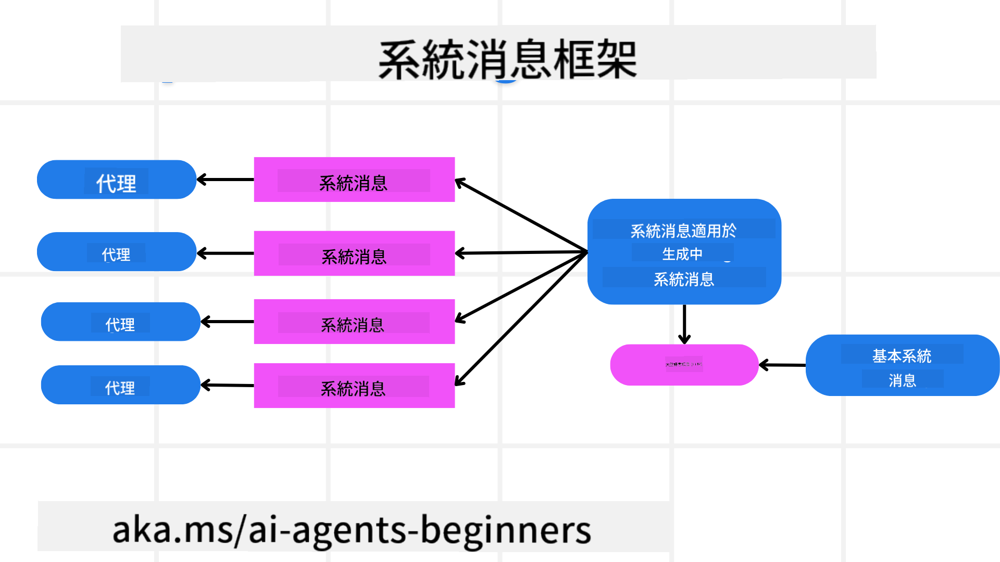
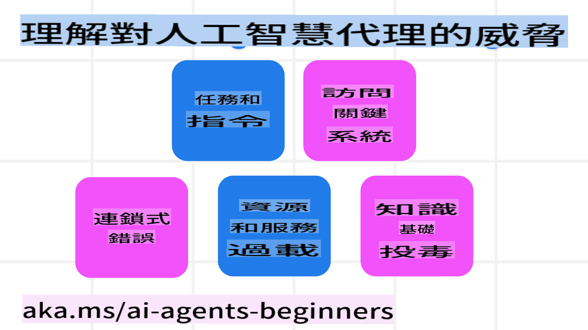
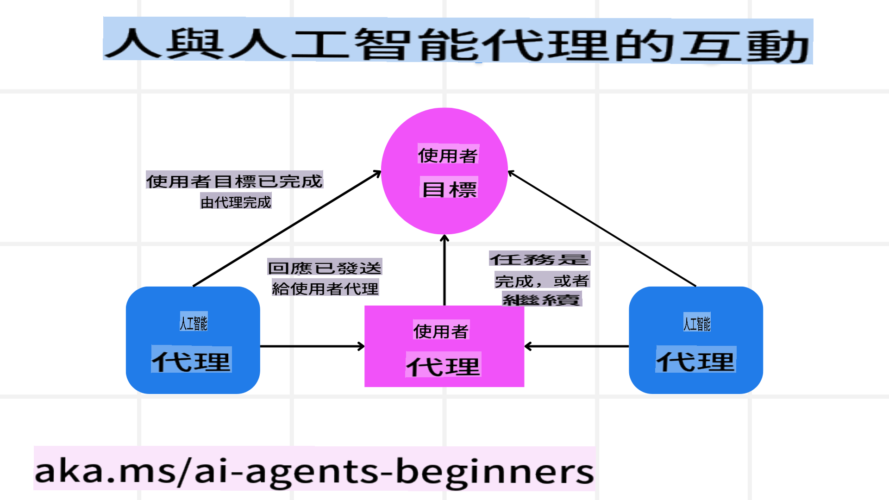

<!--
CO_OP_TRANSLATOR_METADATA:
{
  "original_hash": "f57852cac3a86c4a5ef47f793cc12178",
  "translation_date": "2025-05-20T07:26:41+00:00",
  "source_file": "06-building-trustworthy-agents/README.md",
  "language_code": "tw"
}
-->
[](https://youtu.be/iZKkMEGBCUQ?si=Q-kEbcyHUMPoHp8L)

> _(點擊上方圖片觀看本課程影片)_

# 建立值得信賴的 AI 代理人

## 介紹

本課程將涵蓋：

- 如何建置與部署安全且有效的 AI 代理人
- 開發 AI 代理人時的重要安全考量
- 開發 AI 代理人時如何維護資料與使用者隱私

## 學習目標

完成本課程後，你將能夠：

- 辨識並減輕建立 AI 代理人時的風險
- 實施安全措施，確保資料與存取權限被妥善管理
- 建立能維護資料隱私並提供優質使用者體驗的 AI 代理人

## 安全性

我們先來看看如何打造安全的代理應用程式。安全性代表 AI 代理能如預期運作。作為代理應用的開發者，我們有方法和工具來最大化安全：

### 建立系統訊息框架

如果你曾用大型語言模型（LLM）建置 AI 應用，會知道設計堅固的系統提示或系統訊息有多重要。這些提示設定了 LLM 與使用者及資料互動的規則、指令與指導方針。

對於 AI 代理人來說，系統提示更為重要，因為 AI 代理需要非常具體的指令來完成我們設計的任務。

為了建立可擴展的系統提示，我們可以使用系統訊息框架，來為應用程式中一個或多個代理建立提示：



#### 第一步：建立 Meta 系統訊息

Meta 提示將由 LLM 用來生成代理的系統提示。我們將它設計成模板，以便能有效率地建立多個代理。

以下是一個我們會給 LLM 的 meta 系統訊息範例：

```plaintext
You are an expert at creating AI agent assistants. 
You will be provided a company name, role, responsibilities and other
information that you will use to provide a system prompt for.
To create the system prompt, be descriptive as possible and provide a structure that a system using an LLM can better understand the role and responsibilities of the AI assistant. 
```

#### 第二步：建立基本提示

接著要建立一個基本提示，描述 AI 代理。你應該包含代理的角色、代理要完成的任務，以及代理的其他責任。

範例如下：

```plaintext
You are a travel agent for Contoso Travel that is great at booking flights for customers. To help customers you can perform the following tasks: lookup available flights, book flights, ask for preferences in seating and times for flights, cancel any previously booked flights and alert customers on any delays or cancellations of flights.  
```

#### 第三步：提供基本系統訊息給 LLM

現在我們可以優化這個系統訊息，將 meta 系統訊息作為系統訊息，搭配我們的基本系統訊息。

這樣會產出一個更適合引導 AI 代理的系統訊息：

```markdown
**Company Name:** Contoso Travel  
**Role:** Travel Agent Assistant

**Objective:**  
You are an AI-powered travel agent assistant for Contoso Travel, specializing in booking flights and providing exceptional customer service. Your main goal is to assist customers in finding, booking, and managing their flights, all while ensuring that their preferences and needs are met efficiently.

**Key Responsibilities:**

1. **Flight Lookup:**
    
    - Assist customers in searching for available flights based on their specified destination, dates, and any other relevant preferences.
    - Provide a list of options, including flight times, airlines, layovers, and pricing.
2. **Flight Booking:**
    
    - Facilitate the booking of flights for customers, ensuring that all details are correctly entered into the system.
    - Confirm bookings and provide customers with their itinerary, including confirmation numbers and any other pertinent information.
3. **Customer Preference Inquiry:**
    
    - Actively ask customers for their preferences regarding seating (e.g., aisle, window, extra legroom) and preferred times for flights (e.g., morning, afternoon, evening).
    - Record these preferences for future reference and tailor suggestions accordingly.
4. **Flight Cancellation:**
    
    - Assist customers in canceling previously booked flights if needed, following company policies and procedures.
    - Notify customers of any necessary refunds or additional steps that may be required for cancellations.
5. **Flight Monitoring:**
    
    - Monitor the status of booked flights and alert customers in real-time about any delays, cancellations, or changes to their flight schedule.
    - Provide updates through preferred communication channels (e.g., email, SMS) as needed.

**Tone and Style:**

- Maintain a friendly, professional, and approachable demeanor in all interactions with customers.
- Ensure that all communication is clear, informative, and tailored to the customer's specific needs and inquiries.

**User Interaction Instructions:**

- Respond to customer queries promptly and accurately.
- Use a conversational style while ensuring professionalism.
- Prioritize customer satisfaction by being attentive, empathetic, and proactive in all assistance provided.

**Additional Notes:**

- Stay updated on any changes to airline policies, travel restrictions, and other relevant information that could impact flight bookings and customer experience.
- Use clear and concise language to explain options and processes, avoiding jargon where possible for better customer understanding.

This AI assistant is designed to streamline the flight booking process for customers of Contoso Travel, ensuring that all their travel needs are met efficiently and effectively.

```

#### 第四步：反覆調整與改進

系統訊息框架的價值在於能輕鬆擴展多個代理的系統訊息建立，並且隨時間改進你的系統訊息。通常不會一次就有完全符合需求的系統訊息。能透過改變基本系統訊息並重新執行，進行微調與改進，有助於比較與評估結果。

## 理解威脅

要打造值得信賴的 AI 代理人，了解並減輕對 AI 代理的風險與威脅非常重要。以下僅列出部分對 AI 代理的威脅，以及你如何更好地規劃與準備。



### 任務與指令

**說明：** 攻擊者試圖透過提示或操控輸入來改變 AI 代理的指令或目標。

**緩解方法：** 執行驗證檢查和輸入過濾，以偵測可能危險的提示，避免它們被 AI 代理處理。由於這類攻擊通常需要頻繁與代理互動，限制對話回合數也是防範此類攻擊的方法之一。

### 存取關鍵系統

**說明：** 若 AI 代理可存取存放敏感資料的系統與服務，攻擊者可能會破壞代理與這些服務間的通訊。這可能是直接攻擊，也可能是透過代理間接取得系統資訊。

**緩解方法：** AI 代理應僅在必要時存取系統，以避免此類攻擊。代理與系統間的通訊也應該是安全的。實作身份驗證與存取控制是保護資訊的另一種方式。

### 資源與服務過載

**說明：** AI 代理可使用不同工具與服務來完成任務。攻擊者可能利用此能力，透過 AI 代理發送大量請求攻擊服務，導致系統故障或高額費用。

**緩解方法：** 制定政策限制 AI 代理對服務的請求數量。限制與 AI 代理的對話回合數和請求數也是防止此類攻擊的方法。

### 知識庫中毒

**說明：** 此類攻擊並非直接針對 AI 代理，而是針對 AI 代理所使用的知識庫和其他服務。可能會破壞代理用來完成任務的資料或資訊，導致回應偏頗或非預期。

**緩解方法：** 定期驗證 AI 代理工作流程中使用的資料。確保資料存取安全，且只有受信任的人員能修改，以避免此類攻擊。

### 錯誤連鎖反應

**說明：** AI 代理會使用各種工具與服務來完成任務。攻擊者引發的錯誤可能導致代理連接的其他系統失效，造成攻擊擴散且更難排查。

**緩解方法：** 一種避免方法是讓 AI 代理在受限環境運作，例如在 Docker 容器中執行任務，避免直接攻擊系統。建立備援機制和錯誤重試邏輯，當系統回應錯誤時也能防止更大範圍的系統故障。

## 人類在環中

另一種有效建立值得信賴 AI 代理系統的方法是採用人類在環（Human-in-the-loop）。這種流程讓使用者能在運行期間對代理提供回饋。使用者實際上扮演多代理系統中的代理，透過批准或終止運行流程來參與。



以下是一段使用 AutoGen 展示此概念實作的程式碼範例：

```python

# Create the agents.
model_client = OpenAIChatCompletionClient(model="gpt-4o-mini")
assistant = AssistantAgent("assistant", model_client=model_client)
user_proxy = UserProxyAgent("user_proxy", input_func=input)  # Use input() to get user input from console.

# Create the termination condition which will end the conversation when the user says "APPROVE".
termination = TextMentionTermination("APPROVE")

# Create the team.
team = RoundRobinGroupChat([assistant, user_proxy], termination_condition=termination)

# Run the conversation and stream to the console.
stream = team.run_stream(task="Write a 4-line poem about the ocean.")
# Use asyncio.run(...) when running in a script.
await Console(stream)

```

## 結論

建立值得信賴的 AI 代理人需要謹慎設計、穩健的安全措施以及持續的迭代。透過實作結構化的 meta 提示系統、了解潛在威脅並採取緩解策略，開發者能打造既安全又有效的 AI 代理。此外，加入人類在環的做法，確保 AI 代理持續符合使用者需求，同時降低風險。隨著 AI 持續演進，積極維護安全、隱私及倫理考量，將是促進 AI 系統信賴與可靠性的關鍵。

## 附加資源

- <a href="https://learn.microsoft.com/azure/ai-studio/responsible-use-of-ai-overview" target="_blank">Responsible AI overview</a>
- <a href="https://learn.microsoft.com/azure/ai-studio/concepts/evaluation-approach-gen-ai" target="_blank">Evaluation of generative AI models and AI applications</a>
- <a href="https://learn.microsoft.com/azure/ai-services/openai/concepts/system-message?context=%2Fazure%2Fai-studio%2Fcontext%2Fcontext&tabs=top-techniques" target="_blank">Safety system messages</a>
- <a href="https://blogs.microsoft.com/wp-content/uploads/prod/sites/5/2022/06/Microsoft-RAI-Impact-Assessment-Template.pdf?culture=en-us&country=us" target="_blank">Risk Assessment Template</a>

## 上一課

[Agentic RAG](../05-agentic-rag/README.md)

## 下一課

[Planning Design Pattern](../07-planning-design/README.md)

**免責聲明**：  
本文件係使用 AI 翻譯服務 [Co-op Translator](https://github.com/Azure/co-op-translator) 所翻譯。雖然我們致力於翻譯的準確性，但請注意自動翻譯可能包含錯誤或不準確之處。原始文件的母語版本應被視為權威來源。對於重要資訊，建議使用專業人工翻譯。我們不對因使用本翻譯所產生的任何誤解或誤譯負責。