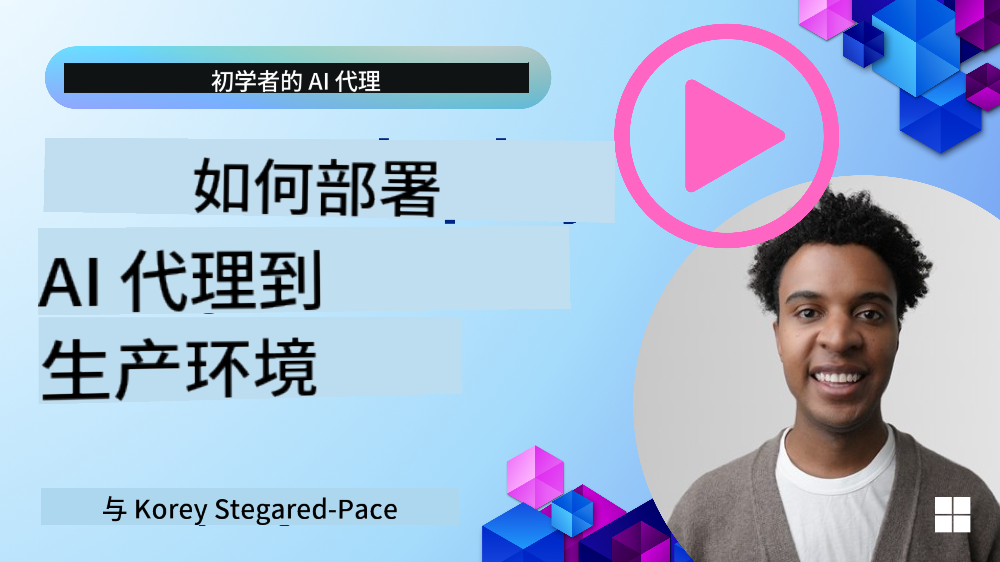

<!--
CO_OP_TRANSLATOR_METADATA:
{
  "original_hash": "1ad5de6a6388d02c145a92dd04358bab",
  "translation_date": "2025-05-20T07:20:45+00:00",
  "source_file": "10-ai-agents-production/README.md",
  "language_code": "zh"
}
-->

> _(点击上方图片观看本课视频)_
# AI Agents 在生产环境中的应用

## 介绍

本课将涵盖：

- 如何有效规划 AI Agent 的生产环境部署。
- 部署 AI Agent 到生产环境时可能遇到的常见错误和问题。
- 如何在保持 AI Agent 性能的同时控制成本。

## 学习目标

完成本课后，你将了解/掌握：

- 提升生产环境中 AI Agent 系统性能、成本和效果的技巧。
- 如何评估你的 AI Agents 及评估内容。
- 部署 AI Agents 到生产环境时如何控制成本。

部署值得信赖的 AI Agents 非常重要。也请参考“构建可信赖的 AI Agents”课程。

## 评估 AI Agents

在部署 AI Agents 的前、中、后阶段，建立一个合适的评估体系至关重要。这能确保你的系统与自己和用户的目标保持一致。

评估 AI Agent 时，不仅要评估代理的输出，还要评估 AI Agent 所运行的整个系统。这包括但不限于：

- 初始模型请求。
- 代理识别用户意图的能力。
- 代理识别合适工具以完成任务的能力。
- 工具对代理请求的响应。
- 代理对工具响应的解读能力。
- 用户对代理响应的反馈。

这样可以更模块化地识别改进点，进而更高效地监控模型、提示词、工具及其他组件调整的效果。

## AI Agents 常见问题及潜在解决方案

| **问题**                                         | **潜在解决方案**                                                                                                                                                                                                             |
| ----------------------------------------------- | ---------------------------------------------------------------------------------------------------------------------------------------------------------------------------------------------------------------------------- |
| AI Agent 执行任务不稳定                          | - 优化给 AI Agent 的提示词，明确目标。 - 找出将任务拆分为子任务并由多个 Agent 处理的场景。                                                                                                                                   |
| AI Agent 进入无限循环                           | - 确保有明确的终止条件，让 Agent 知道何时停止流程。 - 对于需要推理和规划的复杂任务，使用专门用于推理的大型模型。                                                                                                            |
| AI Agent 调用工具表现不佳                        | - 在代理系统外测试和验证工具输出。 - 优化工具的参数、提示词和命名。                                                                                                                                                         |
| 多 Agent 系统表现不稳定                          | - 优化每个 Agent 的提示词，确保它们具体且相互区分。 - 建立层级系统，使用“路由”或控制 Agent 来决定使用哪个 Agent 最合适。                                                                                                 |

## 成本管理

以下是一些管理 AI Agents 生产部署成本的策略：

- **缓存响应** - 识别常见请求和任务，在它们进入代理系统前直接提供响应，是减少类似请求量的好方法。你甚至可以用更基础的 AI 模型实现一个流程，判断请求与缓存请求的相似度。

- **使用小型模型** - 小型语言模型（SLMs）在某些代理用例中表现良好，且能显著降低成本。如前所述，建立评估系统以比较小模型与大型模型的性能，是判断 SLM 在你的用例中表现的最佳方式。

- **使用路由模型** - 类似策略是使用多样化的模型和规模。你可以用 LLM/SLM 或无服务器函数，根据请求复杂度路由到最合适的模型。这不仅有助于降低成本，还能确保关键任务的性能。

## 祝贺

这也是“AI Agents 初学者”课程的最后一课。

我们计划根据反馈和行业变化持续新增课程，欢迎不时回来查看更新。

如果你想继续学习和构建 AI Agents，欢迎加入 <a href="https://discord.gg/kzRShWzttr" target="_blank">Azure AI Community Discord</a>。

我们在那举办工作坊、社区圆桌和“问我任何事”环节。

我们还有一个学习合集，包含更多帮助你开始构建生产环境 AI Agents 的资料。

## 上一课

[元认知设计模式](../09-metacognition/README.md)

**免责声明**：  
本文件由 AI 翻译服务 [Co-op Translator](https://github.com/Azure/co-op-translator) 翻译而成。尽管我们努力确保翻译的准确性，但请注意，自动翻译可能存在错误或不准确之处。原始文件的原文版本应被视为权威来源。对于关键信息，建议采用专业人工翻译。对于因使用本翻译而产生的任何误解或误释，我们概不负责。